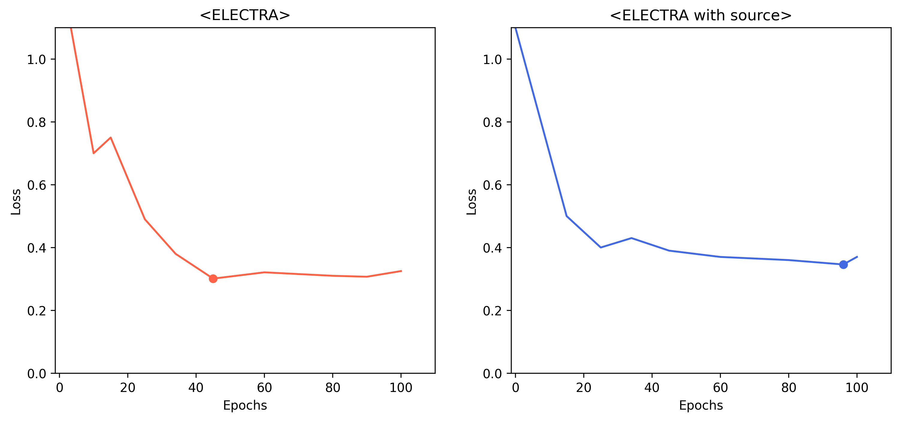
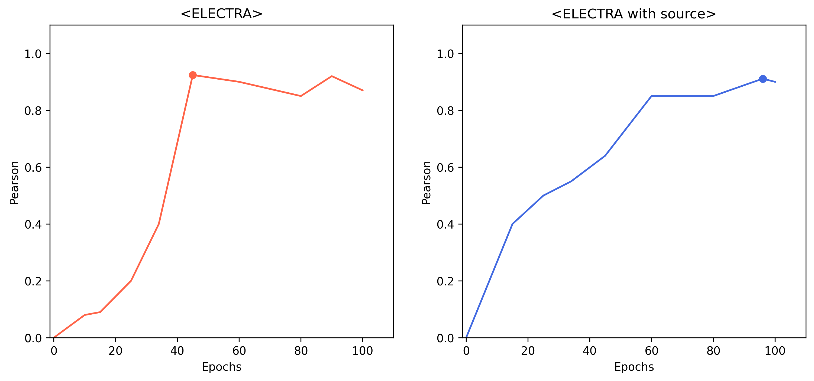
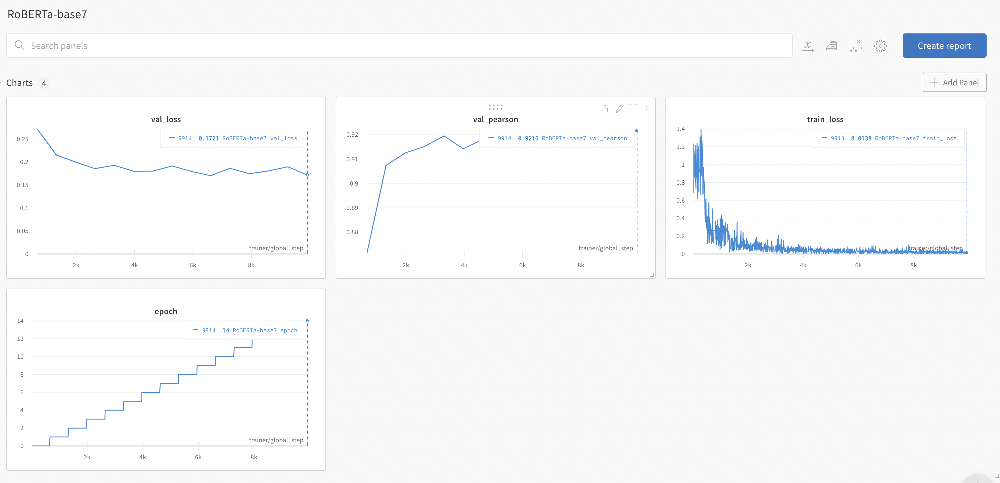
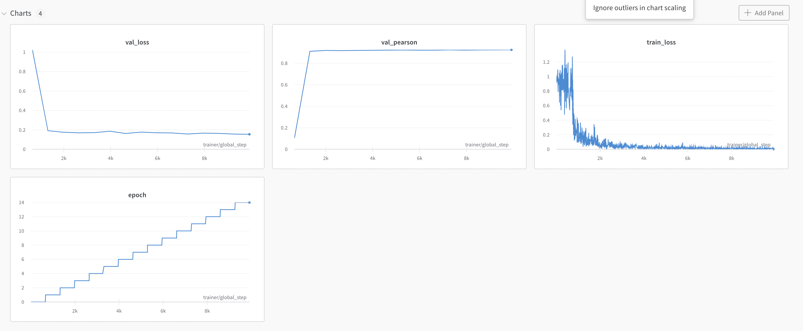
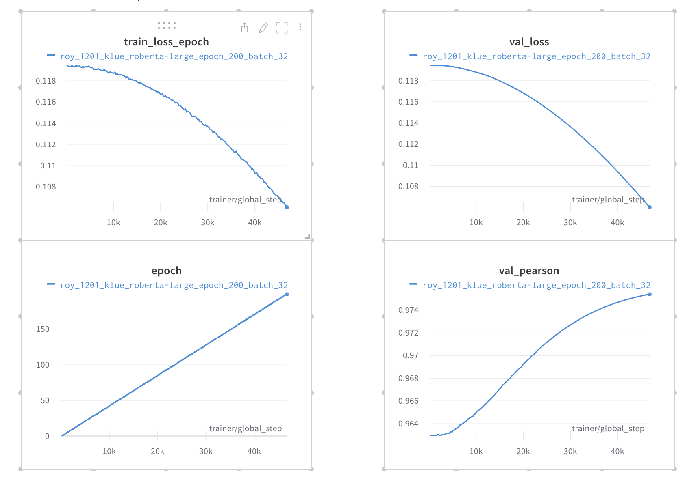

# Results

## ELECTRA

 

## RoBERTa + CNN
klue/RoBERTa (base)
- epochs 15, batch_size 16
- val_loss = 0.172, val_pearson = 0.921

klue/RoBERTa + CNN_layers

- epochs 15, batch_size 16
- val_loss = 0.154, val_pearson = 0.926

## sRoBERTa_Large
klue/RoBERTa (base)
- epochs 200, batch_size 32
- val_loss = 0.106, val_pearson = 0.9754

