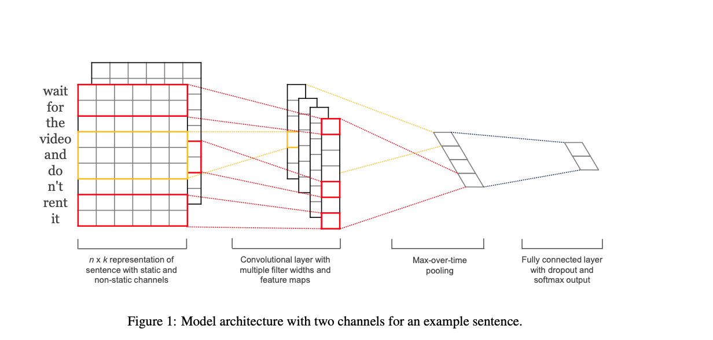
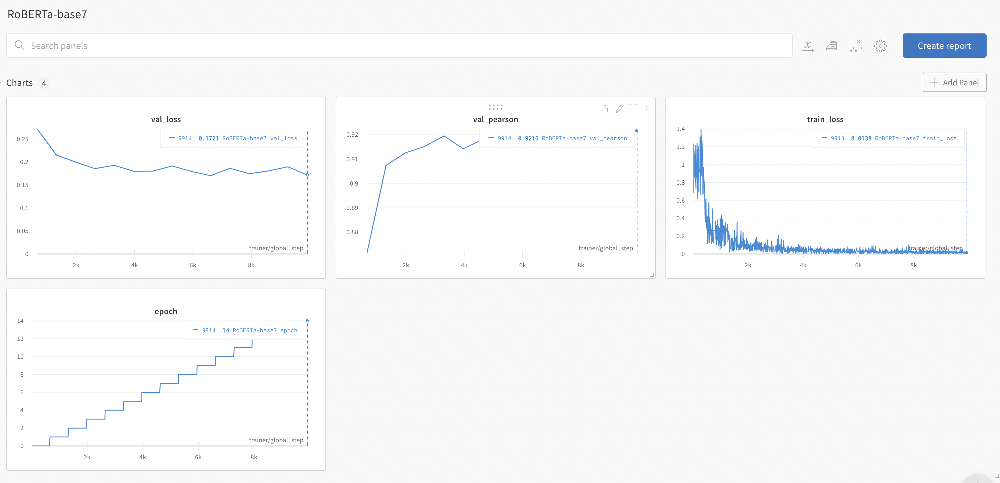
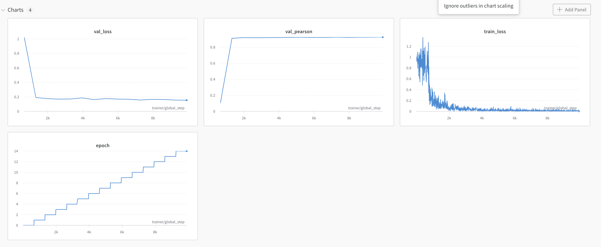

# Overview
- 이현준_T4176
- klue/RoBERTa(base) pre_trianed 모델에 CNN_layer를 추가하였습니다.
- klue/RoBERTa 를 거쳐서 나온 last_hidden_state 에 CNN layer 를 이용해서 feature map 을 만들어 줍니다.
- 새롭게 만든 feature map 에 MaxPooling 을 이용해서 가장 두드러지는 feature 를 가져갑니다.
- 그 이후 Linear layer 를 사용해서 label 과 비교 할 수 있게 해줍니다.

참고 문헌 :Convolution Neural Network for sentence classification<a name="footnote_1"> https://arxiv.org/pdf/1408.5882.pdf </a>

## klue/RoBERTa (base)
- epochs 15, batch_size 16
- val_loss = 0.172, val_pearson = 0.921

## klue/RoBERTa + CNN_layers

- epochs 15, batch_size 16
- val_loss = 0.154, val_pearson = 0.926

- val_loss 는 0.02 정도 하락 했고, val_pearson 은 0.005 상승한 결과를 볼 수 있습니다.